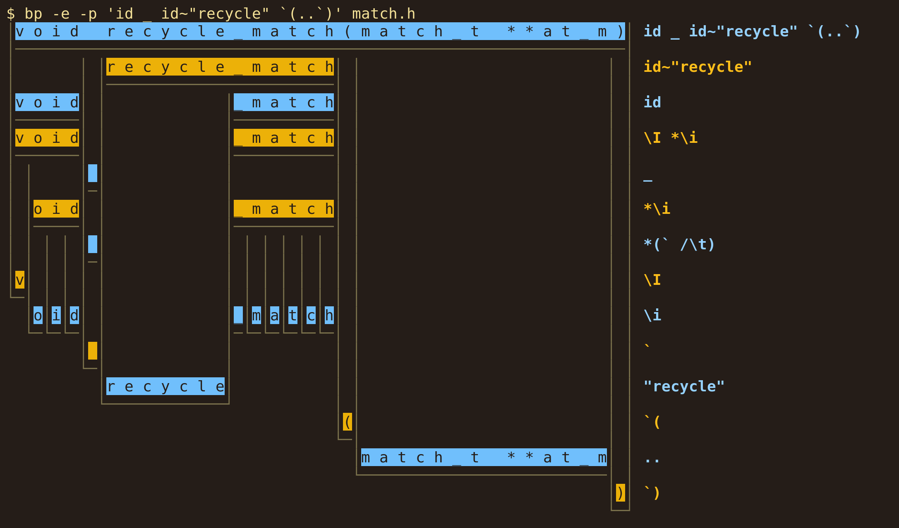

# BP - Bruce's PEG Tool

BP is a parsing expression grammar (PEG) tool for the command line.
It's written in pure C with no dependencies.




## Tutorial

Run `make tutorial` to run through the tutorial. It walks through some basic pattern matching.


## Usage

```
bp [flags] <pattern> [<input files>...]
```

BP is optimized for matching literal strings, so the main pattern argument is
interpreted as a string literal. BP pattern syntax is inserted using curly
brace interpolations like `bp 'foo{..}baz'` (match the string literal "foo" up
to and including the next occurrence of "baz" on the same line).

### Flags

* `-h` `--help` print the usage and quit
* `-v` `--verbose` print verbose debugging info
* `-i` `--ignore-case` perform a case-insensitive match
* `-I` `--inplace` perform replacements or filtering in-place on files
* `-e` `--explain` print an explanation of the matches
* `-l` `--list-files` print only filenames containing matches
* `-r` `--replace <replacement>` replace the input pattern with the given replacement
* `-s` `--skip <skip pattern>` skip over the given pattern when looking for matches
* `-B` `--context-before <N>` change how many lines of context are printed before each match
* `-B` `--context-after <N>` change how many lines of context are printed after each match
* `-C` `--context <N>` change how many lines of context are printed before and after each match
* `-g` `--grammar <grammar file>` use the specified file as a grammar
* `-G` `--git` get filenames from git
* `-f` `--format` `auto|plain|fancy` set the output format (`fancy` includes colors and line numbers)

See `man ./bp.1` for more details.


## BP Patterns

BP patterns are a mixture of Parsing Expression Grammar and Regular
Expression syntax, with a preference for prefix operators instead of
suffix operators.

Pattern            | Meaning
-------------------|---------------------
`"foo"`, `'foo'`   | The literal string `foo`. There are no escape sequences within strings.
`pat1 pat2`        | `pat1` followed by `pat2`
`pat1 / pat2`      | `pat1` if it matches, otherwise `pat2`
`.. pat`           | Any text up to and including `pat` (except newlines)
`.. % skip pat`    | Any text up to and including `pat` (except newlines), skipping over instances of `skip`
`.. = repeat pat`  | Any number of repetitions of `repeat` up to and including `pat`
`.`                | Any single character (except newline)
`^^`               | The start of the input
`^`                | The start of a line
`$$`               | The end of the input
`$`                | The end of a line
`__`               | Zero or more whitespace characters (including newlines)
`_`                | Zero or more whitespace characters (excluding newlines)
`` `c ``           | The literal character `c`
`` `a-z ``         | The character range `a` through `z`
`` `a,b ``         | The character `a` or the character `b`
`\n`, `\033`, `\x0A`, etc. | An escape sequence character
`\x00-xFF`         | An escape sequence range (byte `0x00` through `0xFF` here)
`!pat`             | `pat` does not match at the current position
`[pat]`            | Zero or one occurrences of `pat` (optional pattern)
`5 pat`            | Exactly 5 occurrences of `pat`
`2-4 pat`          | Between 2 and 4 occurrences of `pat` (inclusive)
`5+ pat`           | 5 or more occurrences of `pat`
`5+ pat % sep`     | 5 or more occurrences of `pat`, separated by `sep` (e.g. `0+ int % ","` matches `1,2,3`)
`*pat`             | 0 or more occurrences of `pat` (shorthand for `0+pat`)
`+pat`             | 1 or more occurrences of `pat` (shorthand for `1+pat`)
`<pat`             | `pat` matches just before the current position (lookbehind)
`>pat`             | `pat` matches just in front of the current position (lookahead)
`@pat`             | Capture `pat` (used for text replacement)
`@foo=pat`         | Capture `pat` with the name `foo` attached (used for text replacement)
`@foo:pat`         | Let `foo` be the text of `pat` (used for backreferences)
`pat => "replacement"` | Match `pat` and replace it with `replacement`
`(pat1 @keep=pat2) => "@keep"` | Match `pat1` followed by `pat2` and replace it with the text of `pat2`
`pat1~pat2`        | `pat1` when `pat2` can be found within the result
`pat1!~pat2`       | `pat1` when `pat2` can not be found within the result
`name: pat2`       | `name` is defined to mean `pat`
`name:: pat2`      | `name` is defined to mean `pat` and matches have `name` attached to the result as metadata
`# line comment`   | A line comment

See `man ./bp.1` for more details.


## Grammar Files

BP comes packaged with some pattern definitions that can be useful when parsing
code of different languages. Firstly, there are a handful of general-purpose
patterns like:

Name          | Meaning
--------------|--------------------
`string`      | A string (either single- or double-quoted)
`parens`      | A matched pair of parentheses (`()`)
`braces`      | A matched pair of curly braces (`{}`)
`brackets`    | A matched pair of square brackets (`[]`)
`anglebraces` | A matched pair of angle braces (`<>`)
`_`           | Zero or more whitespace characters (excluding newline)
`__`          | Zero or more whitespace characters, including newlines and comments
`Abc`         | The characters `a-z` and `A-Z`
`Abc123`      | The characters `a-z`, `A-Z`, and `0-9`
`int`         | 1 or more numeric characters
`number`      | An integer or floating point number
`Hex`         | A hexadecimal character
`id`          | An identifier

As well as these common definitions, BP also comes with a set of
language-specific or domain-specific grammars. These are not full language
grammars, but only implementation of some language-specific features, like
identifier rules (`id`), string syntax, and comment syntax (which affects `__`
and other rules). Some of the languages supported are:

- BP
- C++
- C
- Go
- HTML
- Javascript
- Lisp
- Lua
- Python
- Rust
- shell script

These grammar definitions can be found in [grammars](/grammars). To use a
grammar file, use `bp -g <path-to-file>` or `bp --grammar=<path-to-file>`. Once
BP is installed, however, you can use `bp -g <grammar-name>` directly, and BP
will figure out which grammar you mean (e.g. `bp -g lua ...`). BP first
searches `~/.config/bp/` for any grammar files you keep locally, then searches
`/etc/bp/` for system-wide grammar files.

Testing for these grammar files (other than `builtins`) is iffy at this point,
so use at your own risk! These grammar files are only approximations of syntax.


## Code Layout

File                           | Description
-------------------------------|-----------------------------------------------------
[bp.c](bp.c)                   | The main program.
[files.c](files.c)             | Loading files into memory.
[match.c](match.c)             | Pattern matching code (find occurrences of a bp pattern within an input string).
[pattern.c](pattern.c)         | Pattern compiling code (compile a bp pattern from an input string).
[printmatch.c](printmatch.c)   | Printing a visual explanation of a match.
[utf8.c](utf8.c)               | UTF-8 helper code.
[utils.c](utils.c)             | Miscellaneous helper functions.


## Lua Bindings

`bp` also comes with a set of Lua bindings, which can be found in the [Lua/
directory](Lua). The bindings are currently a work in progress, but are fully
usable at this point. Check [the Lua bindings README](Lua/README.md) for more
details.


## Performance

Currently, `bp`'s speed is comparable to hyper-optimized regex tools like
`grep`, `ag`, and `ripgrep` when it comes to simple patterns that begin with
string literals, but `bp`'s performance may be noticeably slower for complex
patterns on large quantities of text. The aforementioned regular expression
tools are usually implemented as efficient finite state machines, but `bp` is
more expressive and capable of matching arbitrarily nested patterns, which
precludes the possibility of using a finite state machine. Instead, `bp` uses a
fairly simple recursive virtual machine implementation with memoization. `bp`
also has a decent amount of overhead because of the metadata used for
visualizing and explaining pattern matches, as well as performing string
replacements. Overall, I would say that `bp` is a great drop-in replacement for
common shell scripting tasks, but you may want to keep the other tools around
in case you have to search through a truly massive codebase for something
complex.


## License

BP is provided under the MIT license with the [Commons Clause](https://commonsclause.com/)
(you can't sell this software without the developer's permission, but you're
otherwise free to use, modify, and redistribute it free of charge).
See [LICENSE](LICENSE) for details.
